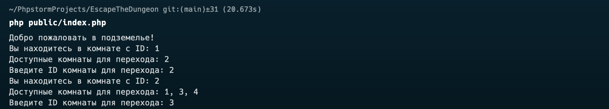
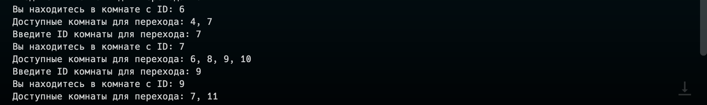

# EscapeTheDungeon

## Описание проекта

EscapeTheDungeon — это текстовая консольная игра, в которой игрок перемещается по подземелью, состоящему из квадратных комнат, соединенных между собой дверями. Цель игрока — найти выход из подземелья, взаимодействуя с различными типами комнат, такими как комнаты с сокровищами и монстрами.

## Структура проекта

Проект организован по шаблону MVC и включает следующие основные компоненты:

- **Модели (Models)**: содержат основные классы для работы с данными.
- **Контроллеры (Controllers)**: управляют потоком данных между классами и представлениями.
- **Представления (Views)**: отвечают за отображение данных пользователю через консоль.

### Дерево каталогов

```
├── README.md
├── composer.json
├── composer.lock
├── data
│   └── dungeon.json
├── package.xml
├── public
│   ├── assets
│   └── index.php
├── src
│   ├── Controllers
│   │   └── GameController.php
│   ├── Models
│   │   ├── Dungeon
│   │   │   ├── Dungeon.php
│   │   │   ├── EmptyRoom.php
│   │   │   ├── MonsterRoom.php
│   │   │   ├── Room.php
│   │   │   └── TreasureRoom.php
│   │   ├── Game
│   │   │   └── Game.php
│   │   └── Player
│   │       └── Player.php
│   └── Views
│       └── ConsoleView.php
```

## Установка и запуск

1. **Склонируйте репозиторий:**
    ```bash
    git clone https://github.com/abdulovia/EscapeTheDungeon.git
    cd EscapeTheDungeon
    ```

2. **Установите зависимости через Composer:**
    ```bash
    composer install
    ```

3. **Запустите игру:**
    ```bash
    php public/index.php
    ```

## Пример вывода в консоли





